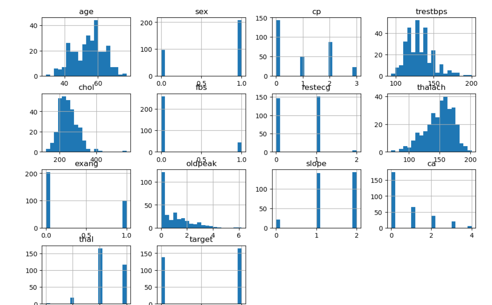
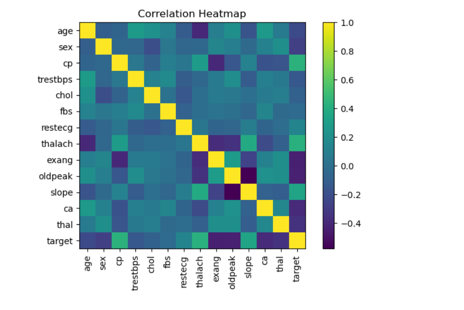
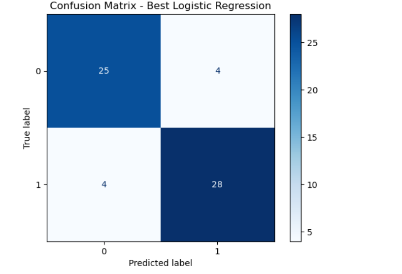

# Health ML Project

This repository contains a Jupyter Notebook (`health_ml.ipynb`) that demonstrates an end-to-end machine learning pipeline for health-related data. The workflow includes dataset handling with AWS S3, exploratory data analysis (EDA), model training, and fine-tuning.

## Project Workflow

1. **Data Handling**  
   - Connect to AWS S3.
   - Check if the dataset bucket exists; create if necessary.
   - Upload dataset (with duplicate checks).
   - Import dataset from S3 for analysis.

2. **Exploratory Data Analysis (EDA)**  
   - Perform descriptive statistics and visualize data distribution.
   - Identify missing values, correlations, and class balance.
   - Example plots:

   
   
   

4. **Model Preparation**  
   - Train-test split.
   - Data preprocessing.

5. **Model Training & Fine-Tuning**  
   - Train baseline models.
   - Fine-tune hyperparameters.
   - Evaluate model performance.

## Requirements

- Python 3.8+
- Jupyter Notebook
- AWS CLI configured with S3 access
- Libraries:
  ```bash
  pip install pandas numpy matplotlib seaborn scikit-learn boto3
  ```

## Usage

1. Clone the repository:
   ```bash
   git clone https://github.com/your-username/health-ml.git
   cd health-ml
   ```

2. Open the notebook:
   ```bash
   jupyter notebook health_ml.ipynb
   ```

3. Run all cells sequentially to reproduce results.


